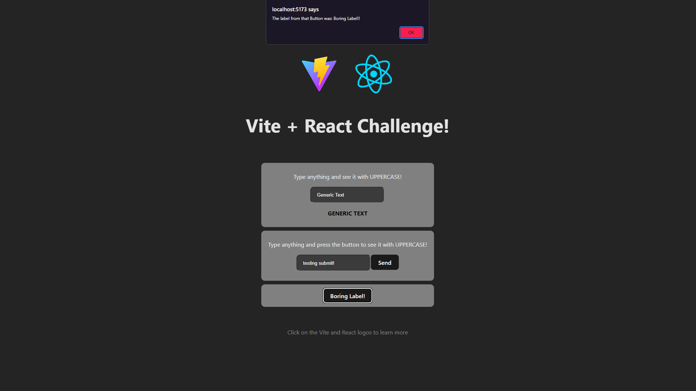

# React + Vite basic challenge
## (Last Update) - 20/01/2024
### This project is a milestone of a FullStack developer course, serving to reinforce foundational principles and then upload it to a GitHub repository.

## Table of contents

- [Overview](#overview)
  - [The challenge](#the-challenge)
  - [Layout](#-layout)
  - [Links](#links)
- [My process](#my-process)
  - [Technologies](#-technologies)
  - [What I learned](#what-i-learned)
- [Author](#author)

## Overview

### The challenge

- [x] Develop a component that allows the manipulation of text color and uppercasing through the use of props.
- [x] Create a button with a generic label that triggers an alert with the button label upon being clicked.

My changes were:

- [x] Implement an input field that dynamically updates based on user input.
- [x] Introduce an additional component that utilizes a submit function.
- [x] Adjust the prop requirement to rely on the states in the inputs while maintaining it for the label.


### 🔖 Layout

<div align="center">
    <p>Layout:</p>
    
</div>

### Links

- Solution URL: [GitHub Repo](https://github.com/bigodrigo/react-vite-quest)
- Live Site URL: [GitHub Page](https://bigodrigo.github.io/react-vite-quest)

## My process

### 🚀 Technologies

- React
- PropTypes
- Form Handle and Submission
- Alert

### What I learned

- I believe this was a more simple challenge, since I have previous experience with more complex demands using React.
- The use of PropTypes is uncommon for me and I understand is a way for better understanding how to use Typescript, the goal is to focus on a more robust code and understanding of better practices
- The following code is my previous solution, using the PropType for the Inputs.

- I found this challenge to be relatively straightforward, given my previous experience with more complex demands involving React.
- The use of PropTypes is not a common practice for me, but I acknowledge that it can provide better understanding of Typescript usage. Its purpose is to cultivate more robust code and an improved comprehension of best practices.
- Below is my previous solution, which utilizes PropTypes for the inputs.

```js
//component
import PropTypes from "prop-types";
import './DynamicText.css'

export default function DynamicText({inputText,handleInputChange,transformedText}) {

    DynamicText.propTypes = {
        inputText: PropTypes.string.isRequired,
        handleInputChange: PropTypes.func.isRequired,
        transformedText: PropTypes.string.isRequired,
    }
    return(
        <div>
            <input
            type="text"
            value={inputText}
            onChange={handleInputChange}
            placeholder="Type here..."
            />
            <p style={{ color: 'blue' }}>{transformedText}</p>
        </div>
    )
}
```

```js
//app
  const [inputText, setInputText] = useState('');
  const [transformedText, setTransformedText] = useState('');

  const handleInputChange = (e) => {
    const text = e.target.value;
    setInputText(text);
    setTransformedText(text.toUpperCase());
  };
  ...
        <DynamicText 
          inputText={inputText}
          handleInputChange={handleInputChange}
          transformedText={transformedText} 
        />
```

## Author

- Portfolio - [Rodrigo](https://portfolio-bigodrigo.vercel.app/)
- GitHub - [bigodrigo](https://github.com/bigodrigo)
- Linkedin - [rodrigo-boquer](https://www.linkedin.com/in/rodrigo-boquer/)